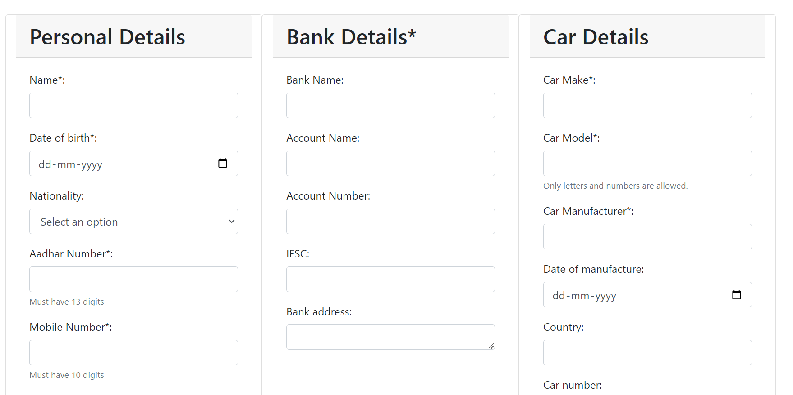
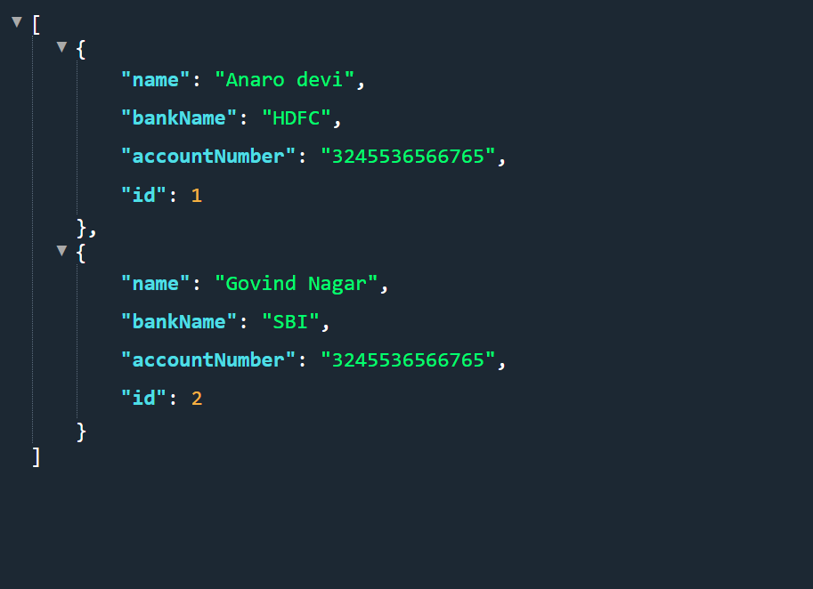
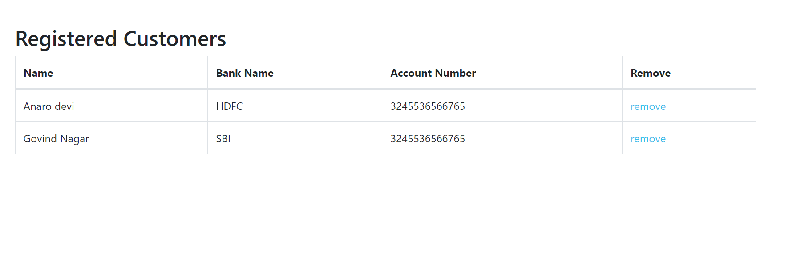

# customer registerion form
   -  add their personal details
   -  add their bank details
   -  add their car details

####  On submitting the form, list of registered customers is shown. In this list there is reemove option, on clicking which we can remove customer data. Cuistomer data is stored in a json file, which is also used as a server

### Json Server

### RegisteredCustomer Page
